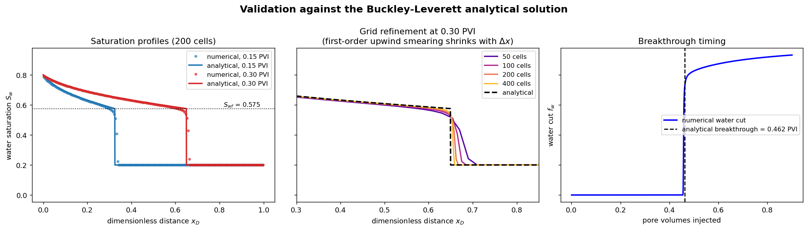
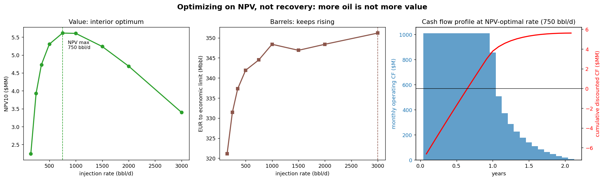
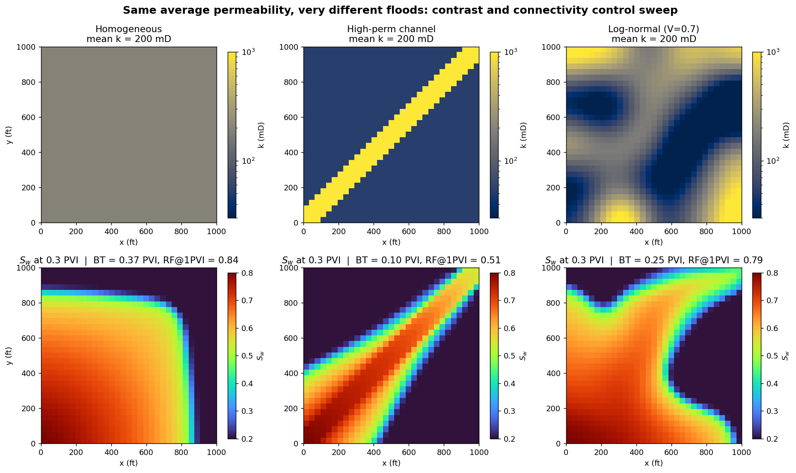

# Reservoir Asset Evaluation Engine
I am a petroleum engineering student at the University of Texas at Austin working toward becoming a reservoir engineer. I decided to build this simulator rather than just read a textbook, to learn the physics and economics of a well while having a little fun. It was, and it only furthered my interest in the energy sector.


A 2D two-phase reservoir simulator built from scratch in Python, validated
against the Buckley-Leverett analytical solution, and coupled to a discounted
cash flow model that optimizes waterflood design on NPV instead of recovery.

The goal is the full arc an acquisitions and divestitures (A&D) team runs on a
producing asset: simulate the physics, convert production to cash flow, and
find the design that maximizes value rather than barrels.

**Physics.** IMPES (implicit pressure, explicit saturation) finite-volume
scheme for incompressible, immiscible oil-water flow. Sparse implicit pressure
solve, upstream-weighted explicit transport, CFL-limited time stepping, Corey
relative permeabilities, arbitrary heterogeneous permeability fields. Every run
prints a water material balance error, which comes back at machine precision
(~1e-14).

**Validation.** The simulator reproduces the exact Buckley-Leverett solution in
1D: saturation profiles match the Welge rarefaction and shock, breakthrough
timing and recovery at breakthrough agree within 1.2% on a 200-cell grid, and a
grid refinement study shows convergence to the analytical front.



**Economics.** Monthly DCF with a flat price deck, royalty, fixed and variable
opex, water handling costs, rate-dependent facilities capex, and truncation at
the economic limit. Sweeping injection rate shows NPV peaking at an interior
optimum (750 bbl/d under base assumptions) while EUR keeps rising with rate.
Designing for maximum barrels instead of maximum value gives up about $2.2MM
on a $5.6MM asset.



## Key results

| Study | Finding |
|---|---|
| Validation (1D, 200 cells) | Breakthrough and recovery within 1.2% of the analytical solution |
| Mobility ratio (M = 0.19 to 3.89) | Recovery at 1 PVI falls from 0.97 to 0.74 as M rises |
| Heterogeneity (same 200 mD average) | A connected high-perm channel cuts recovery from 0.84 to 0.51 |
| NPV optimization | Value peaks at 750 bbl/d; barrels peak at the highest rate tested |



## Repository structure

```
reservoir_sim.py               core simulator (Config + Simulator), base case when run directly
validate_buckley_leverett.py   1D validation vs the analytical solution
mobility_ratio_study.py        four mobility ratios, sweep and recovery comparison
heterogeneity_study.py         channel and correlated log-normal permeability fields
economics.py                   Layer 2: DCF, economic limit, NPV-vs-rate optimization
writeup/simulator_writeup.md   governing equations, discretization, validation, results
figures/                       all output figures
```

## Running it

```
pip install -r requirements.txt
python reservoir_sim.py                  # base case, three figures
python validate_buckley_leverett.py      # validation figure and error report
python mobility_ratio_study.py
python heterogeneity_study.py
python economics.py                      # economics table and NPV figure
```

Each script prints a summary table (including the mass balance check) and
saves figures to `figures/`.

## Scope and honesty

Everything here is built from first principles in Python (NumPy, SciPy,
Matplotlib). It is not a claim of hands-on experience with commercial tools
like ARIES, PHDWin, or ComboCurve; it is the underlying methods those tools
implement, written and validated by hand. Known simplifications (no
compressibility, gravity, or capillary pressure; Dirichlet producer instead of
a Peaceman well index; first-order transport) are documented in the writeup
with the reasoning and the standard fixes.

## Roadmap

- Monte Carlo layer over permeability, OOIP, and price for P10/P50/P90
  reserves and valuation distributions
- Peaceman well model and multi-well patterns
- Decline curve module: fit Arps models to simulated production and compare
  estimated EUR against the known true answer
- Streamlit dashboard for interactive sensitivity analysis
