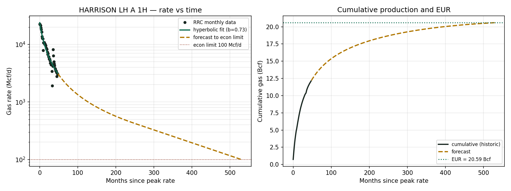

# Phase 2: Haynesville Decline Curve Analysis

Single-well decline curve analysis and EUR estimate for a producing Haynesville gas well, built on free public monthly production data from the Texas Railroad Commission Production Data Query (PDQ).

This is the decline-curve module I listed as future work in the main project. Phase 1 simulates a waterflood from the physics up; Phase 2 takes real field production and runs the reserves side: fit Arps curves, apply a terminal decline switch, and forecast EUR to an economic limit.

## The well

| | |
|---|---|
| Well | Harrison LH A 1H |
| Operator | Comstock Resources |
| API | 42-203-35464 |
| District | Texas RRC District 06 |
| Play | Haynesville Shale, East Texas |

## Headline results

| | |
|---|---|
| Best-fit model | Arps hyperbolic (log-space R2 = 0.89) |
| qi | 23,871 Mcf/d |
| b-factor | 0.73 |
| Cum to date | 12.12 Bcf over 49 months |
| EUR | 20.59 Bcf |

Cumulative to date was checked against the RRC total for the well.

## What is in this folder

